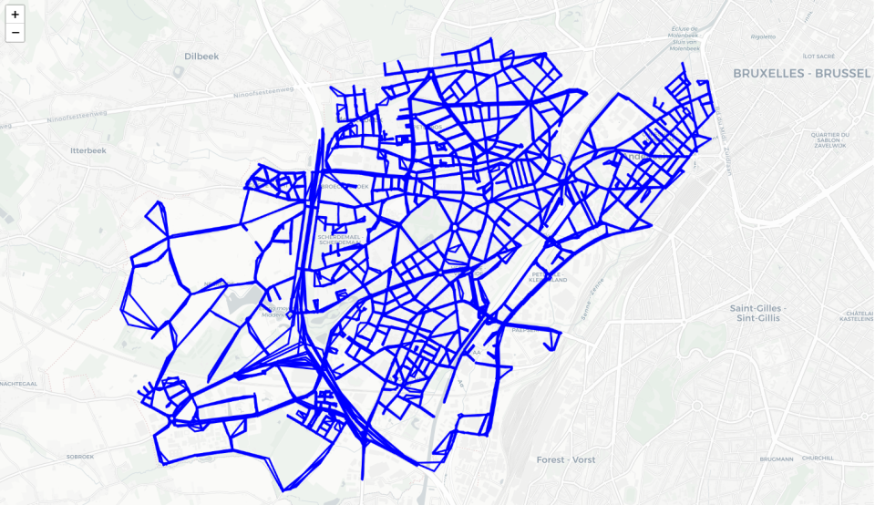

# Table of contents
- [Technology stack](#technology-stack)
- [How to install](#how-to-install)
- [How to use](#how-to-use)
- [Samples](#samples)

A simple project based on [freight transport data](https://www.kaggle.com/datasets/giobbu/belgium-obu) which produces spatio-temporal analysis with graphs and maps on the characteristics of the dataset. <br>

# Technology stack
<div style="padding: 10px; display: flex; align-items: center; background: rgba(251, 251, 251, 1)">
    
    
    
    
    
</div>

The project catalogs two types of documents: road coordinate files in json and event files in csv that record traffic detected under particular conditions. <br>
The read data is written to bson documents in the Mongo database by the **mongo-init** container whose sole purpose is to check if the data is present, and if so, insert it as defined in its javascript files. With the **mongo-express** container, a user interface is offered that makes it easier to read data in Mongo.
<br>
The data are then read from the Neo4j database, container **neo4j**, which with ad hoc functions, creates a node for each coordinate for the considered roads and adding attributes related to the query placed on the Mongo database. For example, attributes can be derived for a specific time slot and for specific roads.
<br>
I dati così ricavati sono rappresentati su grafici e mappe da notebook Jupyter col container **notebook**.

# How to install
To facilitate project installation and sharing, the technology stack is based on docker. <br>
Place in the main folder of the project and execute:
```sh
# only for testing or first boot
docker-compose up -d   
# to see the logs
docker container logs container_name
# to end containers
docker-compose down
# to test changes to images
docker-compose up -d --build --remove-orphans
```
Only on first run enter following token in notebook web page, that is present in **Dockerfile.notebook** file.

# How to use
In order not to overwhelm the size of the repo, csv files from which to read traffic data are not included; you can [download](https://www.kaggle.com/datasets/giobbu/belgium-obu?select=Anderlecht_streets.json)  these files. <br>
Given the amount of data and the limited hardware resources available during the testing phase, the loading code considers only the data coming from the surveys on Anderlecht and Brussels accomplished with a frequency of 15 minutes. <br>
To consider other csv files you need to edit the init.py file
To access docker containers, ports are exposed:
- the 1000 port to access Jupyter
- the 7474 to access the Neo4j page
- the 8081 to access the Mongo Express GUI
<!-- -->
For normal use, it is recommended to access port **1000** directly to populate the Neo4j database and to perform data analysis queries.
Accessing the Jupyter container the first time will require the token found in the **Dockerfile.notebook** file. In later versions it will no longer be required.
<!-- -->
Database data is saved in ad-hoc volumes to ensure its permanence even after any image updates. While for the remaining containers, important session data is saved in the current project as simple files. 
<!-- -->
For more information see **docker-compose.yml**.
# Samples
When the start command is run, the Mongo database is automatically populated with the dataset data.
<br>
To populate the Neo4j database and view some analyses, connect to the Jupyter **notebook** container and run the code blocks in the notebook. After running the python file, a first analysis can be a map view of the first 100 streets in Anderlecht, such as: 
<br>

